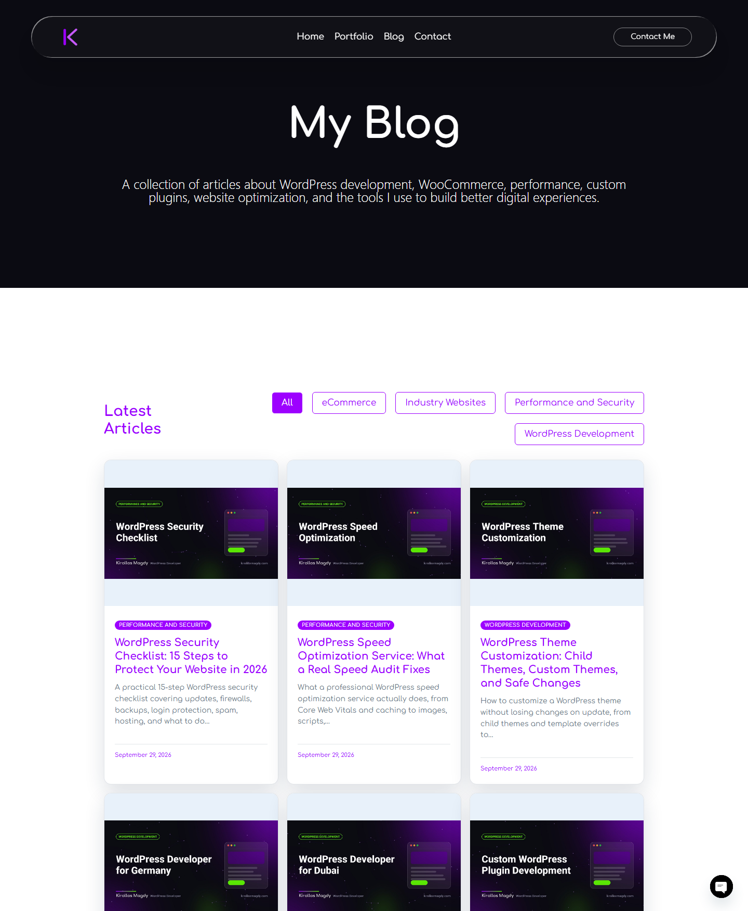
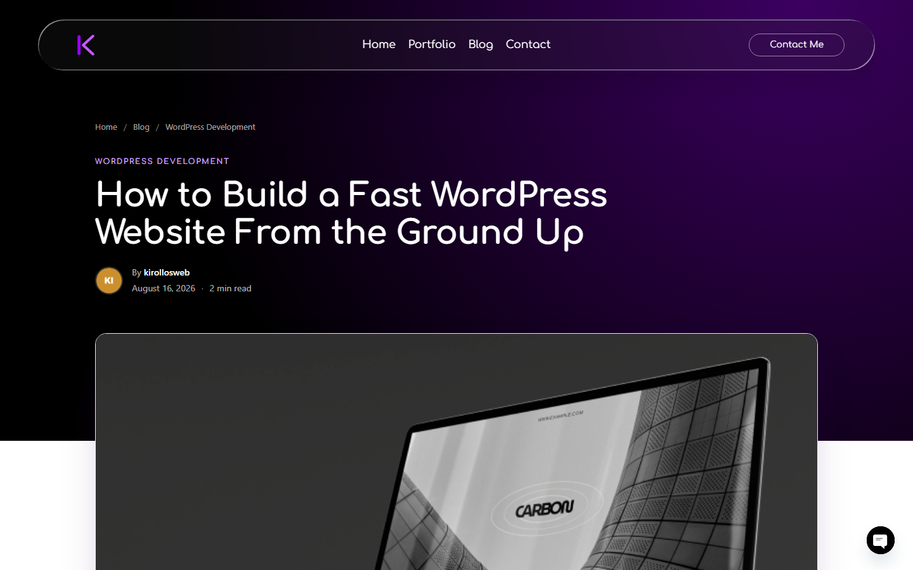

# Kirollos Magdy Portfolio Importer

A WordPress admin plugin that fills my portfolio site, **[kirollosmagdy.com](https://kirollosmagdy.com)**, with content in one click: 14 client case studies and 29 SEO blog posts, each with its images, taxonomy terms and Yoast SEO fields. It is the content companion to [Kirollos Magdy Portfolio Builder](https://github.com/kirollosdev/kirollos-magdy-portfolio-builder).




## What it does

### Portfolio Import (Kirollos Magdy > Portfolio Import)
- Creates 14 projects in the `portfolios` post type with title, excerpt and a body built from challenge, solution and result copy.
- Assigns Categories, Services and Industries from a short curated vocabulary, so the site's filters group projects instead of listing one term each.
- Imports screenshots from a zip with one folder per project, in batches with a live progress bar to avoid server timeouts. A file named `logo` becomes the featured image and card logo; the rest fill the gallery in number order.
- Saves completion dates for every project on one screen.
- Safe to re-run: projects are matched by live URL, then title, and only empty fields are filled, so hand edits survive.

### Blog Importer (Kirollos Magdy > Blog Importer)
- Publishes 29 SEO articles as native Gutenberg blocks, with category, tags, excerpt, Yoast SEO title, meta description and focus keyphrase.
- Sets a branded 1200x630 cover as the featured image, with alt text. A featured image set by hand is never replaced.
- Publish now or import as drafts. Re-importing updates posts instead of duplicating them, and published posts stay published.



## Content pipeline

Articles are written in Markdown with front matter, then built into WordPress blocks by a small toolchain in `modules/blog-importer/`:

```bash
node build-posts.js
```
```bash
python make-covers.py path/to/fonts
```

- **`build-posts.js`** converts Markdown to Gutenberg block markup, gives every post its own publish date (seeded, so rebuilds are stable) and writes `posts/manifest.json`. It fails the build when an SEO title is over 60 characters, a meta description falls outside 120 to 156 characters, the focus keyphrase is missing from the first paragraph, two posts target the same keyphrase, or an internal link points at a page that does not exist.
- **`make-covers.py`** renders a cover for every post with Pillow, in the site's brand colours and fonts.

## Engineering notes

- **Idempotent imports.** Every created post stores its source ID, so re-running updates in place and never duplicates.
- **Batched media import.** Large photo zips are processed over AJAX in small batches with progress reporting, and gallery meta is written as each photo lands, so an interrupted run keeps its progress.
- **Collision-safe merge.** The blog importer was a separate plugin. If that copy is still active, the built-in module steps aside with an admin notice instead of loading twice.
- **WordPress security practices.** Nonces and capability checks on every form, AJAX action and admin action, sanitized input and escaped output.

## Requirements

- WordPress 6.0 or newer, PHP 7.4 or newer
- [Kirollos Magdy Portfolio Builder](https://github.com/kirollosdev/kirollos-magdy-portfolio-builder) for the `portfolios` post type
- Yoast SEO (optional) for the SEO fields to take effect
- Node.js and Python with Pillow, only to rebuild the posts and covers

## Project structure

```
kirollos-magdy-portfolio-importer/
├── kirollos-magdy-portfolio-importer.php   Bootstrap and module loader
├── includes/                               Project data, importer, media, dates, zip import, admin screen
└── modules/blog-importer/
    ├── source/                             Articles in Markdown
    ├── posts/                              Built block markup, manifest and covers
    ├── includes/                           Importer and admin screen
    ├── build-posts.js                      Markdown to blocks, with SEO checks
    └── make-covers.py                      Cover generator
```

## Author

**Kirollos Magdy**, WordPress Developer. Custom WordPress and WooCommerce websites, Elementor widgets and plugins, multilingual and RTL sites, and performance work.

- Portfolio: [kirollosmagdy.com](https://kirollosmagdy.com)
- Hire me: [kirollosmagdy.com/contact](https://kirollosmagdy.com/contact/)

## License

Copyright (C) 2026 Kirollos Magdy. **All rights reserved.** The code, articles and project copy are published for portfolio and code review only. They may not be used, copied, modified, republished, distributed or sold without my written permission. See [LICENSE](LICENSE).
